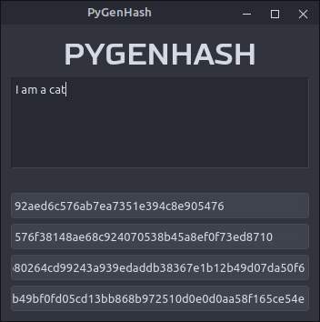
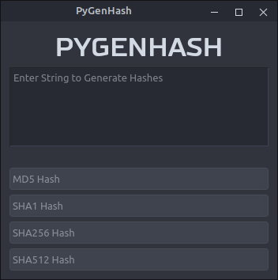

# PyGenHash
Generate Hashes using Python and PyQt

## Requirment
- Python 3
- PyQt5
- hashlib _(Python Standard Library)_

_You may not need to install **hashlib** as it is python built-in library._

Features
========

- Supported hashes MD5, SHA1, SHA256, SHA512
- Convert text based

Contribute
==========

Please feel free to contribute or suggest me if you think something can be done better. I am learning Python and GUIs. It may help me learning new stuff. _Thanks_

**TODO**

- add more hashes
- enable and disable hashes

**Credits**

Font: Russo Sans Bold

Icon: hashtag by [heri sugianto](https://thenounproject.com/heri.mbohwes) from [the Noun Project](https://thenounproject.com/)
